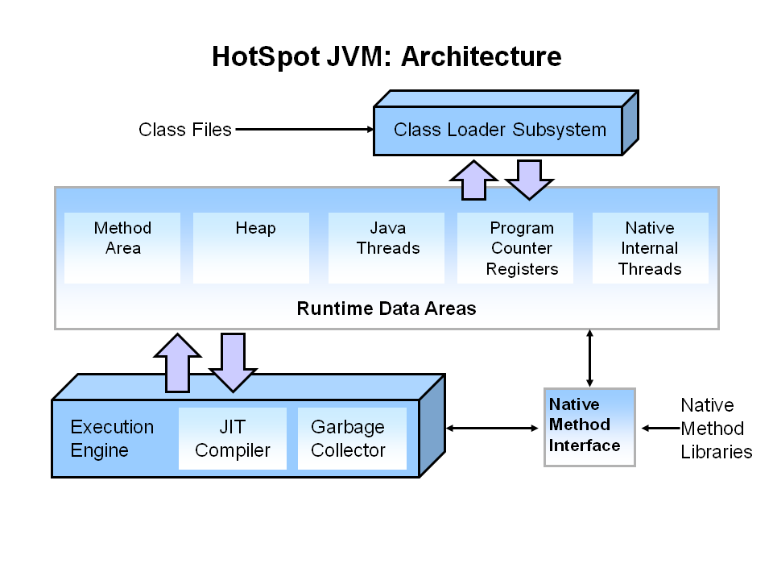
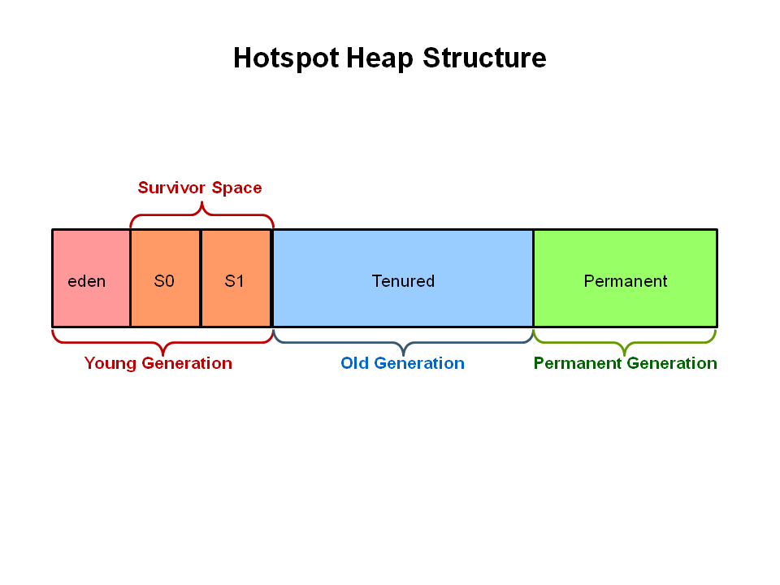
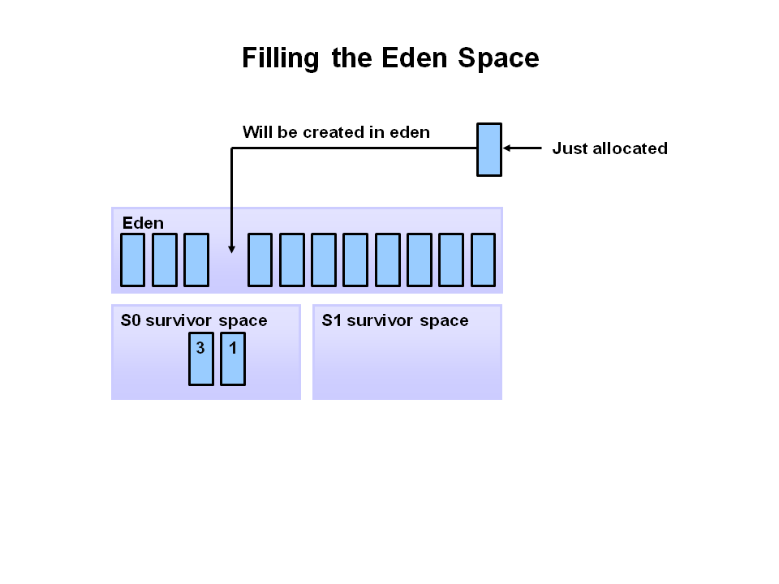

# Java垃圾回收

## 1 JVM

JVM结构如下：


与JVM性能的有关的组件就是下图中高亮的部分。


当JVM调节性能时，JVM主要关注三个组件：heap(堆)，JIT Compiler，Garbage Collector。
- heap(堆)主要用于存储对象数据，这片区域被JVM启动时选择的Garbage collector(垃圾回收)管理。大多数JVM参数选项选项都与堆大小有关，尽量选择最合适的垃圾回收算法。
- JIT Compiler(JIT编译器)对于JVM的性能影响很大，但新版本的JVM基本很少需要调整。

## 2 Java垃圾回收机制

Java的自动垃圾回收（GC）机制主要用于管理JVM中的堆(heap)区域内存，鉴定哪些对象是正在使用的，哪些不是，然后删除未使用的对象，压缩堆内存空间以供继续使用。
对于如何鉴别对象是够可被回收，主要辨别依据是：当无法从正在运行的程序中任何其他活动对象的引用中访问该对象时，则可确定该对象可被回收。**对于大多数垃圾回收算法，它们每次运行是都会遍历JVM堆中所有能到达的对象，剩下的任何未被遍历到的对象都被视为垃圾**，这种方法消耗的时间与堆中的对象数量成正比，所以如果是包含有大量对象大型的应用，这种方法就不合适。为减少这种情况下的资源浪费，很多垃圾回收算法都采用了**世代划分**的方法来进行处理(详见下文2.1 JVM世代划分)，简单的将JVM堆划分成各种世代，就不需要每次对整个堆中的对象进行遍历，而是根据各个世代中对象的生命周期来确定每个世代的扫描周期，如年轻代可能需要更频繁的垃圾回收。
下图蓝色区域表示了各个对象生命周期的分布区域，X轴是以分配的对象字节大小，Y轴是相应字节数对象的生命周期。


垃圾回收的步骤主要包括以下几步：
1. 标记：扫描堆中的所有对象，标记出能够删除的对象。


2. 删除：正常的删除第一步中标记出的可删除的对象


2. 删除并压缩：这与直接删除操作不同的是在进行删除操作后，就对堆空间进行压缩操作，将可用对象移到一起，减少内存碎片。


#### 2.1 JVM世代划分

为提高垃圾回收的效率，JVM中的对被划分为几个世代：年轻代(Young Generation)，老年代(Old Generation)，永久代(Permanent Generation)。


- 年轻代中主要是新的对象以及等待老化(被移动到老年代)的对象。当年轻代被填满时，就会触发一次小垃圾回收(minor garbage collection)，minor collection是基于年轻代中的对象都是高死亡率的。年轻代中的对象大多数都是生命周期很短的对象，其中一部分未被回收的对象会被移动到老年代中。所有的minor garbage collection都是**“停止世界”**事件，当执行minor collection时，所有的应用线程都会被暂停直到回收操作完成。
- 老年代中主要是生命周期较长的对象。通常情况下，对于年轻代中的对象都会设置一个阈值，当年轻代中的对象生存周期达到了该阈值，则会将该对象移动到老年代中。即使是老年代，也需要进行垃圾回收，该操作被称作“大型垃圾回收”（major garbage collection）。major garbage collection同样也是“停止世界”事件，但是该操作执行频率较低，因为老年代中大部分都是生命周期较长的对象。因此对于追求应用响应速度的应用，应该要尽量减少major garbage collection。major garbage collection停止世界的时间受垃圾回收算法的影响。
- 永久代中主要是应用中JVM需要的类以及方法的元数据。永久代中的数据主要是JVM在运行期间根据应用程序需要使用的类，另外，Java SE的类库和方法也存储在永久代中。当JVM发现永久代中的类不会再被使用或者需要新的空间用于存储新的类时也会被集中起来处理掉。永久代的垃圾回收通常是在“全面垃圾回收”（full garbage collection）的操作中。

#### 2.2 对象分配以及老化过程

1. 初始阶段，此时新对象都被分配到了eden空间，两个survivor空间都是空的


2. 新对象不断被分配到年轻代的eden空间中，当年轻代中的eden空间被填满时就会触发minor garbage collection。


3. eden中存在引用的对象会被移动到第一个survivor空间(S0)中，而不存在引用的对象就被删除了，移动到S0中的对象年龄(ege)都标记为1。


4. 在下一次的minor GC中，eden空间中的对象会重复第3步骤中的操作，然而此次eden中的可引用对象是被移动到第二个survivor空间(S1)中，而且此次的GC还会针对S0中的对象做处理，S0中的无引用对象会被删除，而引用对象会被移动到S1空间，且其age加1，从eden移动到S1的对象age是被标记为1的。在执行完GC后，eden以及S0空间应该都被清空了。


5. 接下来的GC中会重复第四步骤中的操作，但是S0和S1对调，即引用对象都被移动到S0中，且age均加1。执行完GC后，eden以及S1空间均被清空了。


6. 循环经过前几个步骤后，当年轻代中存在对象age达到设定的阈值(此演示中为8)时，达到阈值的对象就会被提升到老年代。


7. 当minor GC继续执行时，年轻代中符合条件的对象会持续被提升到老年代中。


8. 以上步骤基本覆盖了年轻代的GC操作。最终，major GC操作会清理并压缩老年代中的空间。


#### 2.3 JVM heap各个世代详情查看

本机中的JVM进程heap中各个世代详情查看查看可通过jdk自带的visual vm工具进行查看。(该工具也可单独下载使用)

#### 2.4 垃圾回收算法

垃圾回收管理器主要在以下几个方面进行内存管理：
- 从操作系统中申请内存并将内存还给操作系统。
- 根据请求将内存分发给应用程序。
- 判断应用程序仍在使用的内存部分。
- 回收未被应用程序使用的内存。
Java HotSpot的垃圾回收器通过以下几个方法来提升以上操作的效率：
- 将内存进行分代处理（如上文所示），这样可将大部分精力集中在包含大量可回收内存区域的世代上。
- 采用多线程等方式提升垃圾回收的效率
- 通过移动存活对象的方式压缩内存空间，以增大可用的连续内存空间。

常用的与GC相关的JVM命令行参数：
| 参数 | 描述 |
| :--- | :--- |
| -Xms | 设置JVM启动时堆的初始值内存大小 |
| -Xmx | 设置JVM堆最大的内存大小 |
| -Xmn | 设置年轻代的内存大小 |
| -XX:PermSize | 设置永久代(Permanent Generation)起始内存大小 |
| -XX:MaxPermSize | 设置永久代(Permanent Generation)最大内存大小 |

命令行参数与各个世代之间的关系图如下：


1. Serial GC(串行垃圾回收算法)

Serial GC是Java SE 5和6的默认回收算法。**对于Serial GC，minor以及major垃圾回收都是串行执行的（使用单核CPU）**。Serial GC使用的是**标记-压缩**方法，Serial GC会将堆中的老对象移动到堆的开头，以便新分配的内存能够以连续的内存块分配在堆的末尾。这样做有利于更快的为堆分配新的空间。
Serial GC适用于对JVM暂停时间不敏感的应用（因为是串行回收的，所以对于堆空间较大的应用每次**Stop World**时间会较长），该算法只会使用单核CPU，因此对于当前机器普遍是多核CPU的情况，该算法可能会造成硬件资源浪费的情况。但是对于堆空间较小如几百兆的应用而言，Serial GC仍能很有效的进行垃圾回收，暂停时间也会较短(进行一个full gc可能会花费几秒钟)。
Serial GC还适用于同一环境下有很多个JVM运行的情况（某些情况下，可能JVM的数量大于CPU的数量）。在这种情况下，只使用一个CPU核心进行垃圾回收可以最大程度上减少对其他JVM进程的干扰，即使可能GC的时间比较长。Serial GC对于这种情况是比较折中的方案。
总之Serial GC适用于内存占用较小的应用以及单CPU环境。

开启Serial GC的命令行参数是：```-XX:+UseSerialGC```
示例:
``` shell
java -Xmx12m -Xms3m -Xmn1m -XX:PermSize=20M -XX:MaxPermSize=20M -XX:+UseSerialGC -jar /path/to/demo.jar
```

2. Parallel GC(并行垃圾回收算法)

**Parallel GC使用多线程对年轻代进行垃圾回收**。Parallel GC的线程数默认与应用所在机器的CPU核心数量相同，也可通过参数：``` -XX:ParallelGCThreads=<desired number> ```，当在单核CPU运行JVM进程时，即使指定了Parallel GC算法，JVM也不会使用该算法而是默认的GC算法。对于多核CPU环境，Parallel GC的垃圾回收效率要优于默认的垃圾回收算法，且年轻代GC暂停时间会更短。
Parallel GC使用了多线程来加快应用的吞吐速度，因此Parallel GC适用于需要完成大量任务且接受长时间的暂停的应用(?)如应用进场执行打印较长的信息或者大量的sql查询动作。

对于Parallel GC算法有两种方式：
- 使用```-XX:+UseParallelGC```参数即可对年轻代使用并行垃圾回收算法，而对老年代则依然是单线程的垃圾回收算法进行垃圾回收且老年代的内存压缩操作也是单线程的。示例：```java -Xmx12m -Xms3m -Xmn1m -XX:PermSize=20M -XX:MaxPermSize=20M -XX:+UseParallelGC -jar /path/to/demo.jar```
- 使用```-XX:UseParallelOldGC```参数启动JVM则是设置了年轻代以及老年代均使用并行的垃圾回收算法。同时老年代的内存压缩操作也是并行的。因为年轻代的操作是复制操作，所以不需要内存压缩的操作。在回收了无引用的对象后，存活对象之间存在各种大小的内存碎片，压缩内存的操作就是讲存活的对象移动到一起，减少内存碎片的存在，提高内存的利用效率。并行回收与并行压缩回收的区别就是后者会在回收对象之后对内存进行压缩操作。使用ParallelOldGC示例：```java -Xmx12m -Xms3m -Xmn1m -XX:PermSize=20M -XX:MaxPermSize=20M -XX:+UseParallelOldGC -jar /path/to/demo.jar```

3. CMS GC(并发标记扫描)

CMS(Concurrent Mark Sweep)回收算法，也称为并发低暂停回收算法，主要收集tenured generation。它通过与应用线程一起运行来减少GC时的暂停时间，通常情况下，CMS GC不会对内存进行压缩操作，即不会移动存活对象，当内存碎片过多时，就会申请一个更大的heap空间。
> CMS GC在年轻代中使用的算法和Parallel GC使用的算法是一样的。
CMS适用于对GC时暂停时间比较敏感且能和回收算法共享资源的应用，如用于回应事件的桌面UI应用，用于回应客户端请求的web服务器等。
CMS垃圾回收器的相关命令行参数为：
- ```-XX:+UseConcMarkSweepGC``` 使用CMS GC
- ```-XX:ParallelCMSThreads=<n>``` 设置并发的线程数为n
完整示例：
``` shell
java -Xmx12m -Xms3m -Xmn1m -XX:PermSize=20m -XX:MaxPermSize=20m -XX:+UseConcMarkSweepGC -XX:ParallelCMSThreads=2 -jar /path/to/demo.jar
```

4. G1 GC（Garbage First）
G1算法是为了取代CMS算法而推出的垃圾回收算法，在Java7中就可以使用了。G1算法也是并行并发且渐进压缩的低暂停时间的垃圾回收算法，相比CMS而言G1会进行内存压缩操作。而且G1算法使用的内存布局与上面的所有垃圾回收算法均不同。
使用```+XX:UseG1GC```启用G1垃圾回收算法。完整示例：
``` shell
java -Xmx12m -Xms3m -XX:+UseG1GC -jar /path/to/demo.jar
```


参考链接：
1. [JVM总览](https://docs.oracle.com/javase/specs/jvms/se13/html/jvms-2.html)
2. [Java Garbage Collection Basics](https://www.oracle.com/webfolder/technetwork/tutorials/obe/java/gc01/index.html)
3. [Java Platform, Standard Edition HotSpot Virtual Machine Garbage Collection Tuning Guide](https://docs.oracle.com/javase/9/gctuning/introduction-garbage-collection-tuning.htm#JSGCT-GUID-326EB4CF-8C8C-4267-8355-21AB04F0D304) 