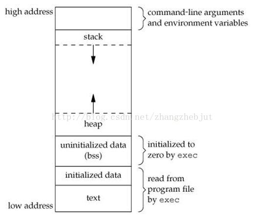
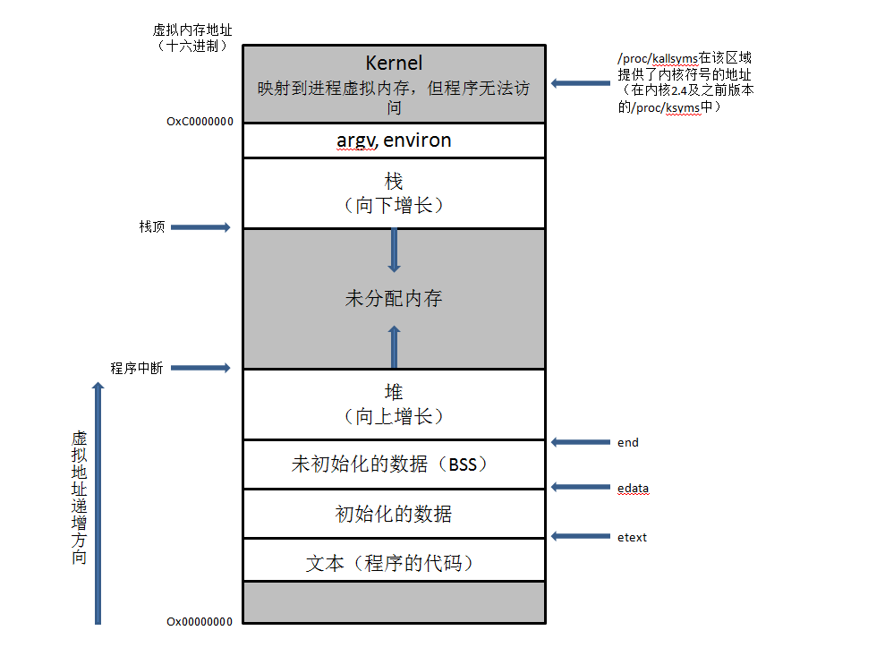
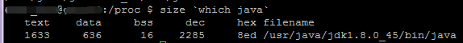
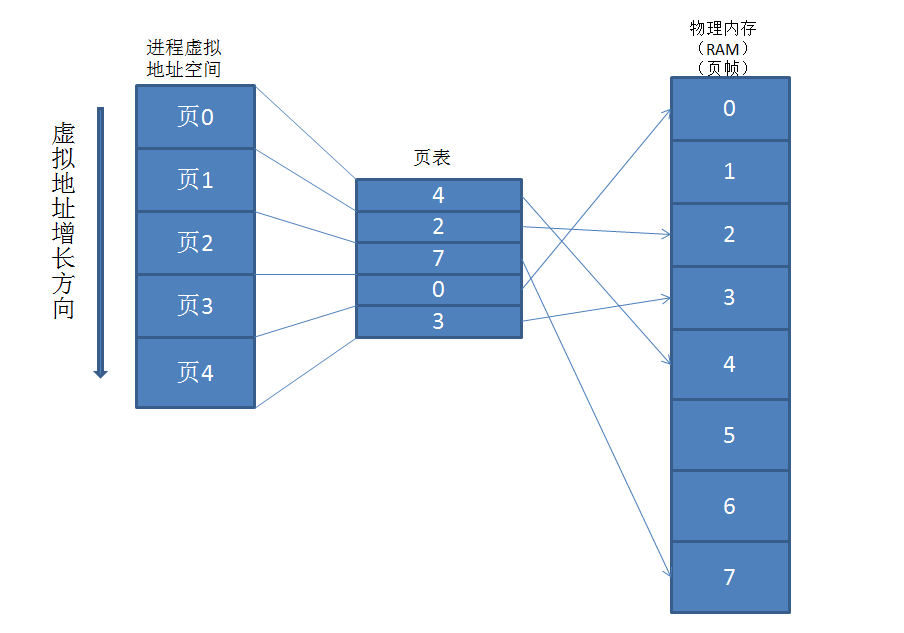

# 进程在Linux中的内存结构

## 进程和程序

进程(progress)是一个可执行程序的(program)的实例。
程序是包含了一系列信息的文件，这些信息描述了如何在运行时创建一个进程，包含以下内容：
- **二进制格式标识**：每个程序文件都包含用于描述可执行文件格式的元信息。
- **机器语言指令**：对程序算法进行编码。
- **程序入口地址**：标识程序开始执行的其实指令位置。
- **符号表以及重定位表**：描述程序中函数和变量的位置以及名称。这些表格有多种用途，其中包含调试和运行时的符号解析(动态链接)。
- **共享库和动态链接信息**：程序文件所包含的一些字段，列出了程序运行是所需要使用的共享库，以及加载共享库的动态连接器的路径名。
- **其他信息**：程序文件还包含许多其他信息，用以描述如何创建进程。

## 一 概述

进程空间分布图如下：
 

每个进程所分配的内存由很多部分组成，通常称之为“段(segment)”
- 文本段(Text)/程序段：包含了进程运行的程序机器语言指令。文本段具有只读属性，以防止进程通过错误指针意外修改自身指令。因为多个进程可同时运行同一程序，所以又将文本段设为可共享，这样，一份代码的拷贝可以映射到所有这些进程的虚拟地址空间中。
- 初始化数据段(Data)：包含显示初始化的**全局变量**和**静态变量**。当程序加载到内存时，从可执行文件中读取这些变量的值。
- 未初始化数据段(BSS)：包含了未进行显示初始化的全局变量和静态变量。程序启动之前，系统将本段内所有内存初始化为0。将经过初始化的全局变量和静态变量与未经初始化的全局变量和静态变量分开存放，其主要原因在于程序在磁盘上存储时，没有必要为未经初始化的变量分配存储空间，相反，可执行文件只需要记录未初始化数据段的位置及所需大小，直到运行时再由程序加载器来分配空间。
- 栈(stack)：是一个动态增长和收缩的段，由栈帧(stack frames)组成。系统会为每个当前调用的函数分配一个栈帧。栈帧中存储了函数的局部变量(所谓自动变量)，实参和返回值。在程序块开始时自动分配内存，结束时自动释放内存，其操作方式类似于程序结构中的栈。
- 堆(heap)：可在运行时（为变量）动态进行内存分配的一块区域。堆顶端称为program break。需要程序员手工分配，手工释放。与数据结构中的怼是两回事，分配方式类似于链表。

> Text，BSS，Data段在编译时就已经决定了进程将占用多少VM，在Linux下可通过size命令查询。如下图所示：

## 二 内核空间和用户空间

从内核角度看，进程由内核用户空间和一系列内核数据结构组成，**用户空间包含了程序代码以及代码所使用的变量，内核数据结构则用于维护进程状态信息。**
记录在内核数据结构中的信息包括许多与进程相关的标识号，虚拟内存表，打开文件的描述符表，信号传递以及处理的有关信息，进程资源使用及限制，当前工作目录和大量的其他信息。

## 三 虚拟内存管理
Linux采用了虚拟内存管理技术。该技术利用了大多数程序的一个典型特征，即访问局部性（locality of reference），以求高效使用CPU和RAM（物理内存）资源。
大多数程序都展现了两种类型的局部性：
- 空间局部性(Spatial locality):是指程序倾向于访问在最近访问过的内存地址附近的内存（由于指令是顺序执行的，且有时会按顺序处理数据结构）。
- 时间局部性(Temporal locality):是指程序倾向于在不久的将来再次访问最近刚访问过的内存地址（由于循环）。
正是由于访问局部性特征，使得程序即便仅有部分地址空间存在于RAM中，仍然可能得以执行。

Linux的虚拟地址空间范围是：0\~4G，Linux内核将这4G字节的空间分为两部分，将最高的1G字节（从虚拟地址0xC0000000到0xFFFFFFF）供内核使用，称为“内核空间”。而较低的3G字节(从虚拟地址0x0000000到0xBFFFFFFF)供各个进程使用，称为“用户空间”。每个进程都可以通过系统调用进入内核，因此，Linux内核有系统内所有进程共享。于是，从具体进程的角度来看，每个进程可以拥有4G字节的虚拟空间。
 Linux使用两级保护机制：0级供内核使用，3级供用户程序使用，每个进程有各自的私有用户空间（0～3G），这个空间对系统中的其他进程是不可见的，最高的1GB字节虚拟内核空间则为所有进程以及内核所共享。 内核空间中存放的是内核代码和数据，而进程的用户空间中存放的是用户程序的代码和数据。使用虚拟地址可以很好的保护内核空间被用户空间破坏，虚拟地址到物理地址转换过程有操作系统和CPU共同完成(操作系统为CPU设置好页表，CPU通过MMU单元进行地址转换)。

 虚拟内存的规划之一是将每个程序使用的内存分割成小型的，固定大小的“页(page)”单元。相应的，将RAM划分成一系列与虚存页尺寸大小相同的页帧。任一时刻，每个程序仅有部分需要驻留在物理内存页帧中。这些页构成了所谓的驻留集(resident set)。程序未使用的页拷贝保存在交换区(swap area)内——磁盘中的保留区域，作为计算机RAM的补充，仅在需要时才会载入物理内存。若进程欲访问的页面目前并未驻留在内存中，将会发生页面错误（page fault），内核即刻挂起进程的执行，同时从磁盘中将该页面载入内存。（程序可调用sysconf(_SC_PAGESIZE)来获取系统虚拟内存的页面大小）

为支持这一组织方式，内核需要为每个进程维护一张页表（page table）。该页表描述了每页在进程虚拟地址空间（virtual address space）中的位置（可为进程所用的所有虚拟内存页面的集合）。页表中的每个条目要么指出一个虚拟页面在RAM中的所在位置，要么表明其当前驻留在磁盘上。

参考链接：
1. [https://www.cnblogs.com/jingyg/p/5069964.html](https://www.cnblogs.com/jingyg/p/5069964.html)
2. [https://blog.csdn.net/yusiguyuan/article/details/45155035](https://blog.csdn.net/yusiguyuan/article/details/45155035)

